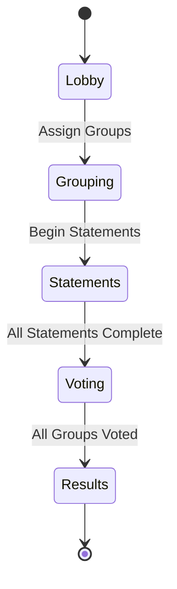
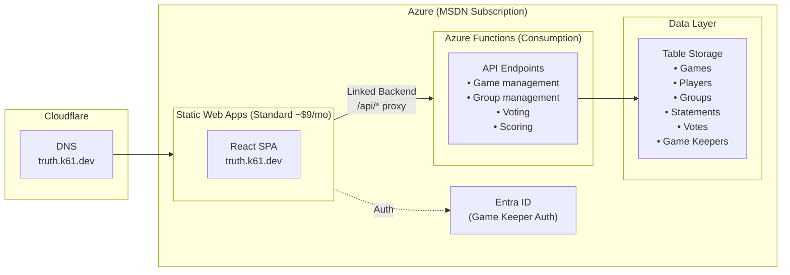

# One Truth – Development Plan

**Production URL**: https://truth.k61.dev
**Repository**: https://github.com/kurtzeborn/one-truth

---

## 1. Overview

A multiplayer party game based on "2 Truths and 1 Lie." A game keeper creates a session and projects a QR code for a large audience. Players join on their phones, get randomly assigned to groups, collaborate on statements, then vote on other groups' lies. Scores are hidden until a dramatic final reveal.

### Core Flow
1. **Game Keeper** creates a game, projects a QR code for the audience
2. **Players** scan QR code on their phones, enter their name to join
3. **Game Keeper** sets group size and randomly assigns players to lettered groups (A, B, C…)
4. **Groups** physically gather and collaborate on 2 truths + 1 lie about their group
5. **Any group member** enters the 3 statements and marks which is the lie
6. **Game Keeper** projects a status board showing each group's statement progress
7. **Game Keeper** transitions to voting mode and advances group-by-group
8. **Players** (excluding the presenting group) vote on which statement is the lie (3 points for correct)
9. **Game Keeper** transitions to results and scores are revealed dramatically from lowest to highest

---

## 2. Requirements Summary

| Requirement | Value |
|------------|-------|
| Max Players | ~100 |
| Group Size | Flexible (gamekeeper enters a number at game time) |
| Groups per Game | Up to 26 (lettered A–Z) |
| Statements per Group | 3 (2 truths + 1 lie) |
| Scoring | 3 points per correct vote |
| Bonus (Stretch) | +2 points for fastest correct vote per group |
| Score Visibility | Hidden until final reveal |
| Voting | Only non-presenting groups can vote |
| Real-time Updates | Polling (designed for easy SignalR upgrade) |
| Statement Editing | Last-writer-wins (no concurrent editing support needed) |

---

## 3. Game States



| State | Description | Game Keeper View | Player View |
|-------|-------------|-----------------|-------------|
| **Lobby** | QR code displayed, players joining | QR code + player list + group size input | "Joined! Waiting for groups…" |
| **Grouping** | Groups assigned, players organizing | Group roster overview | "You are in Group __!" |
| **Statements** | Groups entering their statements | Status board (0/3, 1/3, 2/3, 3/3 per group) | Statement entry form (own group) |
| **Voting** | Voting group-by-group | Projected statements + vote count | Vote on presented group (or wait if own group) |
| **Results** | Dramatic score reveal | Animated leaderboard | Animated leaderboard on phone too |

---

## 4. Platform: Progressive Web App (PWA)

Mobile-first responsive web app. Players join via QR code — no app install needed.

**Why PWA?**
- No app store approval — players join instantly via QR code
- Single codebase for all platforms (phones, tablets, projector laptops)
- Easy updates — deploy and everyone gets the latest version

**Accessibility**: Semantic HTML, full keyboard navigation, color-blind friendly design.

---

## 5. Authentication & Authorization

**Game Keeper**: Authenticated via Microsoft Entra ID + authorized via email allowlist (same pattern as scavenger-hunt)
**Players**: Anonymous with game code + display name

### Game Keeper Auth Flow
1. Sign in with Microsoft account via Entra ID (SWA built-in integration)
2. Email checked against allowlist in Table Storage
3. Only approved emails can create/manage games
4. Any existing game keeper can invite others

### Player Identity
- Display name entered on join (stored in localStorage)
- Session-generated UUID as player ID
- Identity = gameId + playerId + displayName
- Page refresh restores session via localStorage

**Unauthorized user flow:**
```
1. User signs in with Microsoft
2. Email not in allowlist
3. Shows: "You're signed in as user@example.com but you're not
   authorized as a game keeper. Ask an existing game keeper to invite you."
4. Option to sign out and try different account
```

---

## 6. Architecture



**Architecture Notes:**
- **SWA Standard Tier** — Required for linked backends (~$9/month)
- **Linked Backend** — SWA proxies all `/api/*` requests to Function App
- **Auth Header Forwarding** — SWA forwards `x-ms-client-principal` to Function App automatically
- **No CORS Required** — All traffic flows through SWA (same origin)
- **No Blob Storage** — Text-only game, no media uploads
- **Cloudflare DNS** — CNAME pointing to SWA hostname (proxy disabled for SSL compatibility)

---

## 7. Azure Cost Estimate

| Resource | Purpose | Estimated Monthly Cost |
|----------|---------|------------------------|
| **Azure Static Web Apps (Standard)** | Host React SPA + linked backend | $9.00 |
| **Azure Functions (Consumption)** | API endpoints | < $0.01 |
| **Azure Table Storage** | All game data | < $0.01 |
| **Entra ID** | Game Keeper authentication | $0.00 (included) |
| **Custom Domain (truth.k61.dev)** | Subdomain of existing domain | $0.00 (already owned) |

### Storage Calculations (per game, ~100 players, ~15 groups)
- 1 Game record: ~500 bytes
- 100 Player records × ~200 bytes: ~20 KB
- 15 Group records × ~100 bytes: ~1.5 KB
- 45 Statement records × ~300 bytes: ~13.5 KB
- ~1,400 Vote records × ~100 bytes: ~140 KB
- **Total per game: ~175 KB** → negligible cost

**Bottom line: ~$9/month, driven entirely by SWA Standard tier. Storage costs are effectively zero.**

### Optional Future Costs

| Resource | When Needed | Cost |
|----------|-------------|------|
| **Azure SignalR** | Real-time updates upgrade | ~$50/month |
| **Application Insights** | Monitoring/debugging | Free tier: 5 GB/month |

---

## 8. Data Model

### Game
```typescript
interface Game {
  id: string;                  // 4-character alphanumeric join code (also serves as PK)
  createdBy: string;           // Game keeper's email
  createdAt: string;           // ISO 8601
  status: 'lobby' | 'grouping' | 'statements' | 'voting' | 'results';
  groupSize: number;           // Number of players per group (set by GK before assigning)
  currentVotingGroup?: string; // Letter of group currently being voted on (A-Z)
  votedGroups: string[];       // Letters of groups that have completed voting
}
```

**Table Storage:** PartitionKey = `'game'`, RowKey = `gameId`

### Player
```typescript
interface Player {
  id: string;                  // Session-generated UUID
  gameId: string;
  displayName: string;         // Entered by player on join
  groupLetter?: string;        // Assigned during grouping (A-Z, null in lobby)
  joinedAt: string;            // ISO 8601
  score: number;               // Calculated from votes, default 0
}
```

**Table Storage:** PartitionKey = `gameId`, RowKey = `playerId`

### Statement
```typescript
interface Statement {
  gameId: string;
  groupLetter: string;         // A-Z
  statementNumber: number;     // 1, 2, or 3
  text: string;                // The statement content
  isLie: boolean;              // true if this is the lie
  enteredBy: string;           // Player ID who entered/last edited this
  updatedAt: string;           // ISO 8601
}
```

**Table Storage:** PartitionKey = `gameId`, RowKey = `${groupLetter}_${statementNumber}`

### Vote
```typescript
interface Vote {
  gameId: string;
  playerId: string;
  groupLetter: string;         // Which group they're voting on
  chosenStatement: number;     // 1, 2, or 3 (which they think is the lie)
  votedAt: string;             // ISO 8601 (used for fastest-vote stretch goal)
  isCorrect?: boolean;         // Calculated when voting closes for this group
  pointsAwarded?: number;      // 3 for correct, +2 bonus for fastest (stretch)
}
```

**Table Storage:** PartitionKey = `gameId`, RowKey = `${playerId}_${groupLetter}`

### Player Session (localStorage)
```typescript
interface PlayerSession {
  gameId: string;
  playerId: string;
  displayName: string;
  groupLetter?: string;
}
```

### Game Keeper (Allowlist)
```typescript
interface GameKeeper {
  email: string;               // Primary key (lowercase)
  displayName: string;         // From Microsoft profile
  addedBy: string;             // Email of who invited them
  addedAt: string;             // ISO 8601
}
```

**Table Storage:** PartitionKey = `'gamekeeper'`, RowKey = `email`

---

## 9. API Endpoints

### Game Management (Game Keeper Only)
```
POST   /api/games                              Create new game → returns game code
GET    /api/games/:id                          Get game details + status
DELETE /api/games/:id                          Delete game and all associated data
POST   /api/games/:id/assign-groups            Set group size & randomly assign all players to groups
POST   /api/games/:id/transition               Advance game state (lobby→grouping→statements→voting→results)
```

### Player (Anonymous)
```
POST   /api/games/:id/join                     Join game (body: { displayName })
GET    /api/games/:id/players                  Get all players (with group assignments)
GET    /api/games/:id/me                       Get current player's info (by playerId header/param)
```

### Statements (Players in Group)
```
GET    /api/games/:id/groups/:letter/statements     Get statements for a group
PUT    /api/games/:id/groups/:letter/statements/:n  Create/update a statement (last-writer-wins)
```

### Game Keeper Status View
```
GET    /api/games/:id/groups                   Get all groups with statement counts (0/3, 1/3, etc.)
```

### Voting (Game Keeper + Players)
```
POST   /api/games/:id/voting/open/:letter      Open voting on a group (GK only)
POST   /api/games/:id/voting/close/:letter     Close voting on a group, calculate scores (GK only)
POST   /api/games/:id/vote                     Cast a vote (body: { playerId, groupLetter, chosenStatement })
GET    /api/games/:id/voting/results/:letter   Get vote results for a group (after voting closed)
```

### Scoring
```
GET    /api/games/:id/scores                   Get all player scores (only available in results state)
```

### Game Keeper Management (Game Keeper Only)
```
GET    /api/gamekeepers                        List all game keepers
POST   /api/gamekeepers                        Invite new game keeper (body: { email })
DELETE /api/gamekeepers/:email                 Remove game keeper
GET    /api/me                                 Get current user's auth status + game keeper status
```

### Validation Rules
- Display names: 1-20 characters
- Statement text: 1-200 characters
- Game code: 4 alphanumeric characters (uppercase)
- Group size: 2-20 players per group
- Players cannot vote on their own group
- Players can only vote once per group
- Statements can only be edited by members of that group
- State transitions are one-directional (no going back)

---

## 10. Detailed Game Flow

### Phase 1: Lobby
1. Game Keeper signs in → creates a new game
2. Screen shows a large QR code with the game URL: `truth.k61.dev?game=XXXX`
3. Players scan QR code → enter display name → phone shows "Joined! Waiting for groups…"
4. Game Keeper sees a live count of joined players and a player name list
5. Game Keeper enters desired group size (e.g., 5)
6. Game Keeper presses "Assign Groups" → all players randomly divided into groups

### Phase 2: Grouping
1. Each player's phone instantly shows: **"You are in Group D!"** (large letter, maybe with a color)
2. Game Keeper's screen shows a roster: Group A (5 players), Group B (5 players), etc.
3. Players physically find their group members
4. Game Keeper presses "Begin Statements" when ready

### Phase 3: Statements
1. Groups discuss and decide on 2 truths and 1 lie about their group
2. Any group member opens the statement entry form on their phone
3. They enter Statement 1, Statement 2, Statement 3 and mark which one is the lie
4. Other group members see the statements appear on their phones in real-time (polling)
5. Any group member can edit (last-writer-wins)
6. Game Keeper's projected screen shows a status grid:

```
Group A: ███░  (3/3 ✓)
Group B: ██░░  (2/3)
Group C: ███░  (3/3 ✓)
Group D: █░░░  (1/3)
```

7. Once all groups show 3/3, the Game Keeper can transition to voting

### Phase 4: Voting
1. Game Keeper advances to Group A
2. Projector shows Group A's 3 statements (numbered 1, 2, 3) — the lie is NOT indicated
3. All players NOT in Group A see the statements on their phones with voting buttons
4. Group A members see: "Your group is being presented! Watch the screen."
5. Players tap which statement they think is the lie
6. Game Keeper sees a live vote count (not which option is leading — just total votes cast)
7. When ready, Game Keeper closes voting for Group A
8. Projector reveals which statement was the lie (highlight it, animation)
9. Points are awarded: 3 points per correct vote
10. **(Stretch)** +2 bonus points to the fastest correct voter
11. Game Keeper advances to Group B, repeat

### Phase 5: Results
1. Game Keeper transitions to results
2. Projector shows an animated leaderboard
3. Players are revealed from lowest score to highest
4. Each name slides in from the bottom at ~0.5s intervals
5. For large groups (50+ players): batch the bottom 50% at 0.2s, then slow to 0.5s for top half
6. Top 3 get highlighted/celebrated (maybe a subtle confetti animation)
7. Players see the same leaderboard on their phones

---

## 11. Frontend Pages

| Route | Page | Access |
|-------|------|--------|
| `/` | Landing page — Join game (enter code) or Sign in as Game Keeper | Public |
| `/?game=XXXX` | Auto-fill game code from QR, prompt for name | Public |
| `/play` | Player game view (group assignment, statements, voting, results) | Player (has session) |
| `/manage` | Game Keeper dashboard — create game, manage active games | Game Keeper |
| `/manage/game/:id` | Game Keeper game control — QR code, status board, voting controls | Game Keeper |
| `/manage/keepers` | Manage game keeper allowlist | Game Keeper |

### Game Keeper Projected Views (designed for large screens)
- **Lobby**: Large QR code + player count + player names scrolling
- **Grouping**: Group roster grid
- **Statements**: Status grid showing each group's progress
- **Voting**: 3 statements displayed large, vote count indicator
- **Results**: Animated leaderboard reveal

### Player Views (designed for phone screens)
- **Lobby**: "You're in! Waiting for groups…" + player count
- **Grouping**: Large group letter + group member names
- **Statements**: Form to enter/view 3 statements + mark the lie
- **Voting**: 3 statement buttons to vote (or "Your group is up!" if own group)
- **Results**: Scrolling leaderboard matching the projected view

---

## 12. Real-time Update Strategy

**MVP: Polling with React Query**

| Data | Poll Interval | Trigger |
|------|--------------|---------|
| Game status | 3 seconds | Detect state transitions |
| Player list (lobby) | 5 seconds | New players joining |
| Statement status | 5 seconds | Groups entering statements |
| Vote count | 3 seconds | During active voting |
| Scores | N/A | Fetched once on results transition |

**Design for SignalR Upgrade:**
- Abstract polling behind a `useGameUpdates()` hook
- Hook returns the same data shape whether backed by polling or SignalR
- SignalR upgrade = swap hook implementation, no component changes

---

## 13. QR Code

Generate QR code client-side using a library like `qrcode.react`. The QR code encodes: `https://truth.k61.dev?game=XXXX`

Requirements:
- Large enough to scan from a projector screen (~300px minimum on projector)
- Game code also displayed as text below QR (for manual entry)
- QR code regenerates if game code changes

---

## 14. Score Reveal Animation

### Approach
1. Fetch all scores sorted ascending (lowest first)
2. Start with an empty leaderboard
3. Reveal entries one at a time from the bottom of the list (lowest score first)
4. Each entry slides up into position with a brief animation

### Timing Strategy
- **Large groups (50+ players)**: 0.2s per reveal for bottom half, 0.5s for top half
- **Small groups (<50)**: 0.5s per reveal throughout
- **Top 3**: Pause 1s each, larger text, highlight effect
- **#1 Player**: Special celebration (confetti burst via canvas animation or lightweight library)

### Implementation Notes
- CSS `@keyframes` for slide-up animation
- `requestAnimationFrame` or `setInterval` for timing
- Lightweight confetti: ~2KB library or custom canvas particles
- Player phones show same animation (synced via shared state, not real-time)

---

## 15. Stretch Goals

### Fastest Vote Bonus (+2 points)
- Track `votedAt` timestamp on each vote
- When voting closes for a group, find the earliest correct vote
- Award +2 bonus points to that player
- Show "Speed Bonus!" badge next to their name during group results reveal
- **Complexity**: Low — just a sort + bonus field on vote close

### Other Ideas (Future)
- Sound effects for score reveal (optional toggle)
- Game history — Game Keeper can view past game results
- Team photos — groups take a selfie that displays during voting
- Custom themes/colors for events

---

## 16. Tech Stack

| Layer | Technology |
|-------|-----------|
| **Frontend** | React 18, TypeScript, Vite, Tailwind CSS, React Router, React Query |
| **Backend** | Azure Functions (Node.js 20, TypeScript) |
| **Database** | Azure Table Storage |
| **Auth** | Azure Entra ID via Static Web Apps (Game Keeper only) |
| **Hosting** | Azure Static Web Apps (Standard tier) |
| **DNS** | Cloudflare CNAME (truth.k61.dev) |
| **IaC** | Bicep |
| **CI/CD** | GitHub Actions |
| **QR Code** | `qrcode.react` (client-side generation) |

---

## 17. Infrastructure (Bicep)

### Resources
| Resource | Name | SKU/Tier |
|----------|------|----------|
| Resource Group | `rg-one-truth-prod` | — |
| Static Web App | `swa-one-truth-prod` | Standard |
| Function App | `func-one-truth-prod` | Consumption |
| Storage Account | `stonetruth{uniqueString}prod` | Standard_LRS |
| App Service Plan | `asp-one-truth-prod` | Consumption (Y1) |

### Table Storage Tables
| Table | Purpose |
|-------|---------|
| `games` | Game sessions |
| `players` | Player records (partitioned by gameId) |
| `statements` | Group statements (partitioned by gameId) |
| `votes` | Player votes (partitioned by gameId) |
| `gamekeepers` | Authorized email allowlist |

### SWA Configuration
- Custom domain: truth.k61.dev
- Linked backend: Function App
- Auth: Entra ID provider enabled
- Route rules: block direct access to `/api/*` auth endpoints

---

## 18. Project Structure

```
one-truth/
├── .github/
│   ├── copilot-instructions.md
│   └── workflows/
│       └── deploy.yml           # CI/CD pipeline
├── docs/
│   ├── plan.md                  # This file
│   ├── DEPLOYMENT.md            # Deployment guide
│   └── DEVELOPMENT.md           # Local dev setup
├── functions/
│   ├── src/
│   │   ├── games/               # Game CRUD + state transitions
│   │   ├── players/             # Join, player list
│   │   ├── statements/          # Statement CRUD
│   │   ├── voting/              # Vote casting + results
│   │   ├── scoring/             # Score calculation
│   │   ├── gamekeepers/         # Allowlist management
│   │   └── shared/              # Auth helpers, table client, utils
│   ├── host.json
│   ├── local.settings.json
│   ├── package.json
│   └── tsconfig.json
├── infra/
│   ├── main.bicep               # All Azure resources
│   └── main.bicepparam          # Parameters
├── web/
│   ├── src/
│   │   ├── components/          # Shared UI components
│   │   ├── pages/               # Route pages
│   │   ├── hooks/               # useGameUpdates, useAuth, etc.
│   │   ├── api/                 # API client functions
│   │   └── types/               # TypeScript interfaces
│   ├── index.html
│   ├── package.json
│   ├── tailwind.config.js
│   ├── tsconfig.json
│   └── vite.config.ts
├── staticwebapp.config.json     # SWA routing + auth config
├── start-dev.ps1                # Local dev startup (Windows)
├── start-dev.sh                 # Local dev startup (macOS/Linux)
└── README.md
```

---

## 19. Development Phases

### Phase 1: Foundation
- [ ] Initialize repo structure (web + functions + infra)
- [ ] Set up Bicep infrastructure
- [ ] Configure GitHub Actions CI/CD
- [ ] Set up local development environment (Azurite + Vite proxy)
- [ ] Implement Game Keeper auth (Entra ID + allowlist)
- [ ] Create/delete game API + basic UI

### Phase 2: Lobby & Grouping
- [ ] Game creation with QR code display
- [ ] Player join flow (scan QR → enter name)
- [ ] Player list with live count (polling)
- [ ] Group size input + random group assignment
- [ ] Player group assignment display
- [ ] Game Keeper group roster view

### Phase 3: Statements
- [ ] Statement entry form (3 statements + mark the lie)
- [ ] Last-writer-wins statement updates
- [ ] Group member statement view (polling)
- [ ] Game Keeper status board (statement progress per group)
- [ ] State transition: statements → voting

### Phase 4: Voting
- [ ] Game Keeper voting controls (open/close per group, advance to next)
- [ ] Projected statement display (3 statements, large format)
- [ ] Player voting interface (tap to vote, excluded if own group)
- [ ] Vote count display for Game Keeper
- [ ] Lie reveal animation after voting closes
- [ ] Score calculation (3 points per correct vote)

### Phase 5: Results
- [ ] Score calculation and ranking
- [ ] Animated leaderboard reveal (bottom-up, 0.5s per entry)
- [ ] Top 3 celebration effects
- [ ] Player phone leaderboard view
- [ ] Game cleanup

### Phase 6: Polish & Stretch
- [ ] Fastest vote bonus (+2 points) — stretch goal
- [ ] Speed bonus badge display
- [ ] Responsive design polish (projector vs phone)
- [ ] Error handling and edge cases
- [ ] DNS setup (truth.k61.dev via Cloudflare)
- [ ] Production deployment and testing

---

## 20. Edge Cases & Design Decisions

| Scenario | Behavior |
|----------|----------|
| Player joins after groups assigned | Not allowed — show "Game already in progress" |
| Odd number of players for group size | Last group may be smaller (e.g., 13 players ÷ 5 = groups of 5, 5, 3) |
| Player refreshes page mid-game | Session restored from localStorage |
| Player closes browser and reopens | Session restored from localStorage |
| Two players editing same statement | Last-writer-wins — latest save overwrites |
| Player tries to vote on own group | API rejects; UI hides vote buttons for own group |
| Player tries to vote twice on same group | API rejects; UI shows "Already voted" |
| Game Keeper closes voting before all vote | Allowed — stragglers miss out |
| No players join | Game Keeper can delete game |
| Group has only 1 player | Allowed but impractical — GK should set appropriate group size |
| Game code collision | Generate new code if collision detected (4-char = 1.6M combinations) |
| Game Keeper disconnects | Game state persists in Table Storage; GK can reconnect and resume |
